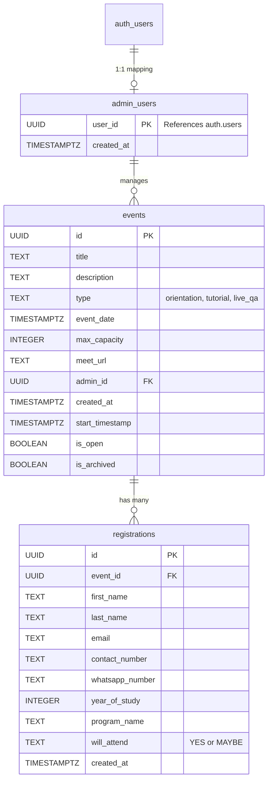

# CampusQA Master Product Requirements Document (PRD)

## 1. System Overview
**Purpose**: CampusQA is a comprehensive event management and student Q&A platform tailored for Event management. It facilitates the discovery, registration, and administration of campus events such as Orientations, Tutorials, and Live Q&A sessions. The platform is designed to provide a seamless registration flow for students and a robust, secure dashboard for administrators to manage events and track attendance.

## 2. Technical Stack
* **Frontend Framework**: Next.js 16.1.6 (App Router)
* **UI/Styling**: TailwindCSS (v4) with Custom CSS variables (`globals.css`)
* **Components & Animations**: React (19.2), Framer Motion, Lucide React (Icons)
* **Backend Backend-as-a-Service**: Supabase (PostgreSQL, Auth, RLS)
* **Data Fetching/State**: Supabase SSR (`@supabase/ssr`)
* **Integrations**: Google APIs (Google Calendar for event invites/Meet integration), Resend (Email automation)
* **Deployment**: Vercel
* **Utilities**: date-fns (Date formatting), xlsx (Data export)

## 3. Information Architecture
The application is structured into three main routing areas:

### Public & Student Routes
* `/` (Home): The main landing page where students can discover active, open, and upcoming events.
* `/events/[id]`: Detailed event view where students can register, view capacity, and see scheduling and location/Meet details.
* `/api/subscribe`: Newsletter subscription endpoint.

### Admin Routes (Protected via Middleware)
* `/admin/login`: Authentication portal for administrators.
* `/admin`: The main dashboard for viewing active and archived events, tracking registration metrics, and exporting reports.
* `/admin/events/new`: Interface for creating new events.
* `/admin/events/[id]`: Detailed view for managing a specific event's registrations and attendees.

### API Routes
* `/api/calendar/add-attendees`: Automatically integrates with Google Calendar to add registered emails to the corresponding Google Meet event.

## 4. Database Schema
The data model is built on PostgreSQL via Supabase. Below is the simplified Entity-Relationship (ER) diagram representing the core tables.

### Row Level Security (RLS) Policies
* `admin_users`: 
  * SELECT: Only admins can view the admin list (checks if `auth.uid()` matches).
  * INSERT/UPDATE/DELETE: Restricted to Service Role only.
* `events`: 
  * SELECT: Viewable by everyone (Public).
  * INSERT/UPDATE/DELETE: Restricted to admins only (using `is_admin(uid)` helper).
* `registrations`: 
  * SELECT: Public can perform aggregate count queries (`USING (true)`), but full row viewing is restricted to admins by application logic.
  * DELETE: Restricted to admins only.

## 5. Feature Specifications

### 5.1 Event Creation & Management
* Admins can create events specifying the title, description, category (Orientation, Tutorial, Live Q&A), date/time, and a Google Meet URL.
* Admins can set `max_capacity` constraints.
* The dashboard includes manual controls to open/close registration and archive past events.
* **Archiving**: Events that have passed their `start_timestamp` or are manually archived are hidden from the public view but retained in the admin reports.

### 5.2 Registration Flow
* Students view a real-time capacity bar.
* The registration form collects: Name, Email, Contact/WhatsApp number, Year of Study, Program Name, and Attendance Intention.
* Registrations update the live capacity bar. Once `registration_count >= max_capacity`, the UI automatically labels the event as "Full" and disables further registrations.
* Event registration automatically closes within 2 hours of the `start_timestamp`.
* **Google Calendar Integration**: Registered emails are automatically added to the Google Calendar event matching the mapped `meet_url` via `/api/calendar/add-attendees`.

### 5.3 QR Code Generation (Planned/Upcoming)
* **Requirement**: System must generate unique QR codes for each registered student for on-campus event check-ins.
* **Design Blueprint**: Future integration will append a generated QR Code (e.g., using `qrcode.react`) to the confirmation email (via Resend) and display it on the post-registration Thank You page. Admins will have a mobile-friendly scanner interface on the dashboard to validate attendance at the door.

### 5.4 Moodle-Integrated Help Features (Planned/Upcoming)
* **Requirement**: Deep integration with the University of Zambia's Moodle LMS environment.
* **Design Blueprint**: Future updates will introduce SSO (Single Sign-On) with Moodle or a REST API sync to automatically pull a student's `program_name` and `year_of_study`, reducing friction in the registration flow. Additionally, Live Q&A registration links will be directly accessible as embedded help widgets within Moodle coursework pages.

## 6. Security Logic
* **Middleware Server Protection (`src/proxy.ts`)**: Next.js Server-side middleware intercepts all `/admin/:path*` requests before components render.
  1. Validates the Supabase session token.
  2. Queries the `admin_users` table to verify if the authenticated user has admin privileges.
  3. Non-admins are instantly redirected back to `/admin/login?error=unauthorized` before any protected HTML is sent or streamed.
* **Database RLS Constraints**: The `is_admin(uid)` SQL helper function acts as a definitive source of truth at the PostgreSQL database level, mitigating any risk of API tampering from client-side vulnerability. Even if a user bypassed frontend checks, the DB will reject their insert/update/delete operations.

## 7. UI/UX Guidelines
* **Design System**: "Liquid Glass Morphism"
* **Core Principles**: High aesthetic value utilizing translucent layers, animated backgrounds, and blurred elements conveying a modern, premium feel. Focuses on spatial depth.
* **Color Palette**: 
  * **Brand**: Green spectrum (`#00A65A` to `#007A42`) representing the Campus QA brand.
  * **Surfaces**: Soft whites (`#F4F7F6`) and custom alpha values for glass effects.
* **Component Styling (`globals.css`)**:
  * **`.glass-card`**: Core container using `backdrop-filter: blur(40px) saturate(1.5)` with inset white borders, subtle drop shadows, and a hover zoom/levitation effect.
  * **`.liquid-blob`**: Floating, animated radial gradients placed fixed behind the main content to provide a vibrant, moving background structure mimicking liquid.
  * **Gradient Elements**: Borders (`.gradient-border`) and Text (`.gradient-text`) use matching brand green gradients for calls to action.
  * **Interactive Transitions**: Utilizing `cubic-bezier(0.4, 0, 0.2, 1)` across all buttons (`.btn-primary`, `.btn-secondary`, `.btn-danger`) for smooth scaling and shadow diffusion on hover and click states.
